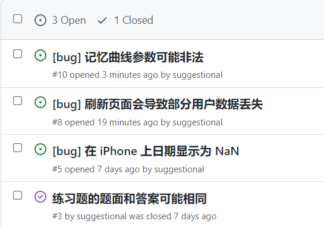
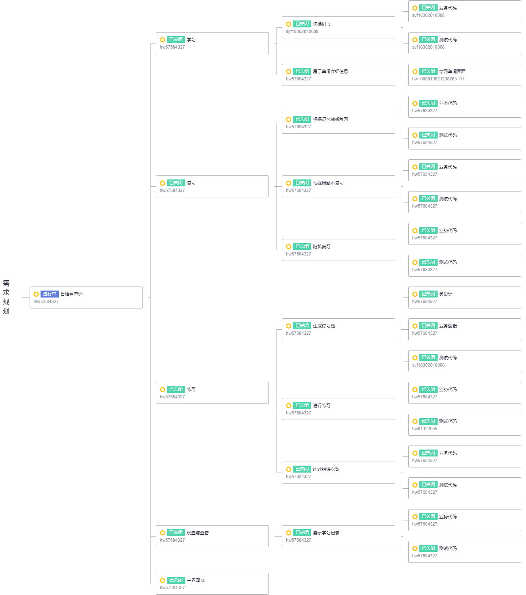
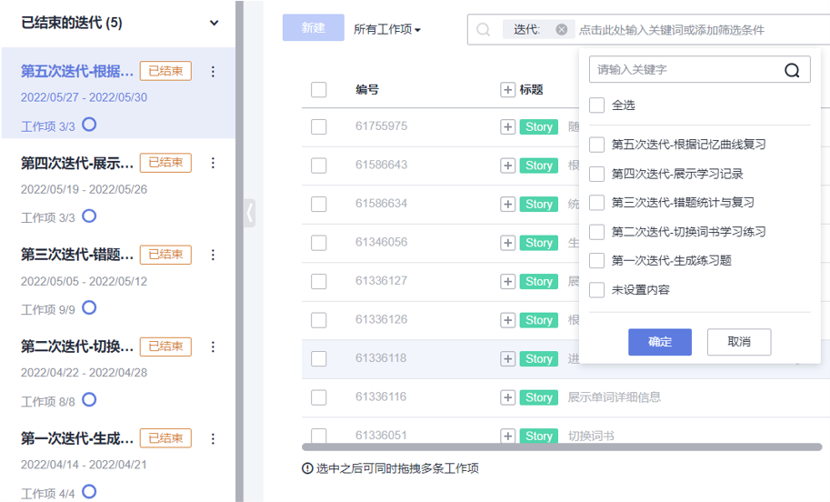

## Neon

### 需求文档

通过腾讯文档的方式在线编辑，在 docs 目录下，有最终版本的离线需求文档，其中包含项目概述，术语列表，用户故事，验收测试，此处不过多展开。


### 安装与配置开发环境

前往 https://nodejs.org/en/ 下载 nodejs，默认安装即可。

命令行检查 npm 是否安装：`npm -v`

如果安装成功，继续安装 ionic，`npm install -g @ionic/cli`

检查是否安装成功：`ionic -v`

如果安装成功，切换到项目目录，`ionic serve`，如果提示缺少 vue 的依赖包，输入 Y 安装即可，之后应当会自动打开网页界面。

ionic 安装文档：https://ionicframework.com/docs/intro/cli


### 安装与配置运行环境

安装 npm 后，在本项目根目录运行以下指令：

```shell
npm ci	# 安装项目依赖
npm run build --if-present	# 构建项目
npm run test:unit	# 运行测试
npm install -g serve	# 安装 serve 以部署 vue 项目
serve -s dist	# 部署打包好的项目
```


### 项目源代码和发布版本

本项目托管在 [GitHub](https://github.com/suggestional/Neon)，使用了 GitHub workflows 进行自动化测试和部署，在服务器上有最新的发布版本，服务器地址：119.45.30.230。本项目没有数据库，所用到的基础数据集在 src/assets 目录下。本项目已经预先打包好一个可执行版本，即 dist 目录下的所有内容，运行以下指令即可部署：

```shell
npm install -g serve	# 安装 serve 以部署 vue 项目
serve -s dist	# 部署打包好的项目
```


### 开发过程

#### Commit Message

遵循如下格式：

```
<修改类型>: <修改的内容> 
```

修改类型分为如下四类：

- `feat`：新的 feature。
- `fix`：修复 bug。
- `add`：对现有的代码添加新内容，并非新 feature。
- `test`：对现有代码进行测试。

#### Branch

以功能或 bug fix 为单位创建分支，任务完成后执行事先写好的测试，并进行 code review，若无问题合并入 main 分支，始终保持 main 分支处于可交付状态。

#### Code Review

通过微信群消息和腾讯会议反馈 code review 结果。

#### Issue

使用 issue 对 bug 或不符合认知的问题进行追踪和修复，绑定对应的 commit，修复完成后关闭 issue。以下是 Issue 列表，目前还存在部分已知的问题未能修复。



#### Devcloud 工作项规划

细分到每个 Task 指定对应的人员负责完成。



#### Devcloud 迭代

共分为 5 次迭代，以用户故事为基本单位进行迭代，目前已全部结束。




### 优化方向

1. 修复已知的 bug
2. 对移动端做进一步适配，打包成移动端应用（如 apk，ipa 等安装包）


### 其他内容

期末汇报 PPT 在 docs 目录下。

由于一些特殊原因，项目仓库发生过一次迁移，原仓库地址：https://github.com/Summer-Shen/Neon（可能未开源），现仓库地址：https://github.com/suggestional/Neon（开源）。Commit 记录完整保留，但 pull request 记录有部分缺失，PPT 中截图为原仓库中的 pull request，并非凭空杜撰。
